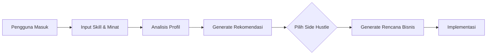

# 🚀 Side Hustle Finder

<div align="center">
  
  
  
  
  

  **Temukan side hustle yang cocok dan buat rencana bisnis personal!**

  [Demo Langsung](#demo-langsung) • [Fitur](#-fitur) • [Instalasi](#-instalasi) • [Dokumentasi API](#-dokumentasi-api)

</div>

## 📋 Gambaran Umum

Side Hustle Finder adalah aplikasi web pintar yang membantu individu menemukan peluang penghasilan sampingan berdasarkan keahlian, minat, dan tujuan mereka. Menggunakan algoritma pencocokan yang canggih, aplikasi ini menganalisis profil pengguna terhadap database side hustle yang telah dikurasi dan menghasilkan rencana bisnis personal dengan langkah-langkah yang dapat diambil.

## ✨ Fitur Utama

### 🎯 **Pencocokan Cerdas**
- **Analisis Skill**: Cocokkan keahlian Anda dengan 20+ kategori keahlian yang tersedia
- **Skor Kecocokan**: Sistem scoring yang memperhitungkan kecocokan skill dan trend pasar
- **Rekomendasi Personal**: 5 rekomendasi teratas yang disesuaikan dengan profil Anda

### 📊 **Perencanaan Bisnis**
- **Rencana Bertahap**: Timeline 3 fase (Setup → Klien Pertama → Scale Up)
- **Proyeksi Finansial**: Estimasi pendapatan bulan 1, 3, dan 6
- **Langkah Aksi**: 5 langkah konkrit untuk memulai

### 💼 **Database Side Hustle**
6 kategori side hustle yang telah dikurasi:
1. **Kreatif** - Desain Grafis Freelance
2. **Digital Marketing** - Manajemen Media Sosial
3. **Pendidikan** - Bimbingan Belajar Online
4. **Bisnis** - Toko E-commerce
5. **Penulisan** - Penulisan Konten
6. **Administratif** - Asisten Virtual

## 🛠️ Teknologi yang Digunakan

- **Backend**: Python 3.8+, Flask 2.0+
- **Frontend**: HTML, CSS, JavaScript
- **Data Processing**: Pandas
- **Session Management**: Flask Sessions
- **API**: RESTful JSON API

## 🚀 Instalasi Cepat

### Prasyarat
- Python 3.8 atau lebih tinggi
- pip (Python package manager)

### Langkah-langkah Instalasi

1. **Clone Repository**
```bash
git clone https://github.com/username/side-hustle-finder.git
cd side-hustle-finder
```

2. **Buat Virtual Environment**
```bash
python -m venv venv
# Windows
venv\Scripts\activate
# Mac/Linux
source venv/bin/activate
```

3. **Install Dependencies**
```bash
pip install flask pandas
```

4. **Jalankan Aplikasi**
```bash
python app.py
```

5. **Akses Aplikasi**
Buka browser dan kunjungi: `http://localhost:5000`

## 📁 Struktur Proyek

```
side-hustle-finder/
├── app.py              # File aplikasi utama
├── templates/          # File HTML
│   └── index.html     # Halaman utama
├── static/            # CSS, JS, images
│   ├── css/
│   ├── js/
│   └── images/
├── requirements.txt   # Dependencies
└── README.md         # Dokumentasi ini
```

## 🔧 Konfigurasi

### Variabel Environment
Buat file `.env` untuk konfigurasi:

```env
FLASK_APP=app.py
FLASK_ENV=development
SECRET_KEY=your_secret_key_here
```

### Database Side Hustle
Database side hustle disimpan dalam list `SIDE_HUSTLES` di `app.py`, berisi:
- Judul dan deskripsi
- Kategori dan keahlian yang dibutuhkan
- Potensi penghasilan
- Komitmen waktu
- Platform yang direkomendasikan
- Sumber belajar

## 📡 Dokumentasi API

### Endpoint Utama

#### 1. `GET /`
**Deskripsi**: Halaman utama aplikasi
**Response**: HTML page dengan form input

#### 2. `POST /assess`
**Deskripsi**: Analisis profil pengguna dan berikan rekomendasi
**Request Body**:
```json
{
  "skills": ["writing", "design", "marketing"],
  "interests": ["creative", "digital"],
  "weekly_hours": 15,
  "target_income": 2000
}
```

**Response**:
```json
{
  "matches": [
    {
      "id": 1,
      "title": "Freelance Graphic Design",
      "match_score": 85,
      "matching_skills": ["design"],
      "missing_skills": ["creativity", "software"],
      "earning_potential": {"low": 500, "high": 3000},
      "time_commitment": "5-15 hours/week",
      "trend_score": 85
    }
  ],
  "user_profile": {...}
}
```

#### 3. `POST /generate_plan`
**Deskripsi**: Generate rencana bisnis untuk side hustle tertentu
**Request Body**:
```json
{
  "hustle_id": 1
}
```

**Response**:
```json
{
  "business_plan": {
    "hustle": {...},
    "timeline": {
      "months_to_profit": 3,
      "weekly_hours": 15,
      "phase_1": "Setup & Learning (1-2 weeks)",
      "phase_2": "First Clients (1 month)",
      "phase_3": "Scale Up (2-3 months)"
    },
    "action_steps": [...],
    "financial_projections": {...}
  }
}
```

## 🧠 Algoritma Pencocokan

### Skor Kecocokan
```
Match Score = (Jumlah Skill yang Cocok / Total Skill Dibutuhkan) × 100
```

### Ranking
Side hustle diurutkan berdasarkan:
1. Skor kecocokan (descending)
2. Skor trend (descending)
3. Potensi penghasilan

### Rencana Bisnis
- **Timeline**: Dihitung berdasarkan target income dan rata-rata penghasilan
- **Proyeksi**: Estimasi realistis berdasarkan data historis
- **Langkah**: Panduan bertahap yang dapat ditindaklanjuti

## 🎨 Frontend Features

### Halaman Utama
- Form input skill dengan autocomplete
- Pilihan minat dan preferensi
- Input target waktu dan pendapatan
- Responsive design

### Halaman Hasil
- Kartu rekomendasi side hustle
- Visualisasi skor kecocokan
- Detail lengkap setiap opsi
- Tombol generate rencana

### Halaman Rencana
- Timeline visual
- Langkah-langkah detail
- Proyeksi finansial
- Opsi download/print

## 📊 Database Keahlian

20+ keahlian yang didukung:
```
writing, design, programming, marketing, sales, teaching,
photography, video editing, social media, seo, analytics,
customer service, project management, research, data analysis,
creativity, communication, organization, leadership, problem solving
```

## 🔄 Alur Penggunaan



## 🚀 Deployment

### Deploy ke Heroku
```bash
# Buat Procfile
echo "web: gunicorn app:app" > Procfile

# Deploy
heroku create side-hustle-finder
git push heroku main
```

### Deploy ke PythonAnywhere
1. Upload file ke PythonAnywhere
2. Setup virtual environment
3. Konfigurasi WSGI file
4. Reload aplikasi

## 🧪 Testing

### Unit Testing
```python
import unittest
from app import app, SideHustleFinder

class TestSideHustleFinder(unittest.TestCase):
    def setUp(self):
        self.app = app.test_client()
        self.finder = SideHustleFinder()
    
    def test_skill_assessment(self):
        skills = ['writing', 'design']
        result = self.finder.assess_skills(skills)
        self.assertGreater(len(result), 0)
    
    def test_business_plan_generation(self):
        plan = self.finder.generate_business_plan(1, {'weekly_hours': 10, 'target_income': 1000})
        self.assertIsNotNone(plan)
```

### Run Tests
```bash
python -m unittest discover tests/
```

## 📈 Roadmap

### Versi 1.1 (Q1 2024)
- [ ] Login/Register system
- [ ] Save favorite side hustles
- [ ] Progress tracking

### Versi 1.2 (Q2 2024)
- [ ] Integration with job platforms API
- [ ] Community forum
- [ ] Success stories section

### Versi 2.0 (Q3 2024)
- [ ] Mobile app version
- [ ] AI-powered skill gap analysis
- [ ] Marketplace for services

## 🤝 Kontribusi

Kontribusi sangat diterima! Ikuti langkah berikut:

1. Fork repository
2. Buat branch feature (`git checkout -b feature/AmazingFeature`)
3. Commit changes (`git commit -m 'Add some AmazingFeature'`)
4. Push to branch (`git push origin feature/AmazingFeature`)
5. Open Pull Request

### Panduan Kontribusi
- Ikuti PEP 8 style guide untuk Python
- Gunakan meaningful commit messages
- Update documentation sesuai kebutuhan
- Tambahkan tests untuk fitur baru

## 📝 Lisensi

Distributed under MIT License. See `LICENSE` for more information.

## 👥 Tim Pengembang

- **Lead Developer**: [Nama Anda]
- **UI/UX Designer**: [Nama Designer]
- **Data Analyst**: [Nama Analyst]

## 💬 Dukungan & Komunitas

- **Issues**: [GitHub Issues](https://github.com/username/side-hustle-finder/issues)
- **Discussions**: [GitHub Discussions](https://github.com/username/side-hustle-finder/discussions)
- **Email**: support@sidehustlefinder.com

## 🙏 Ucapan Terima Kasih

Terima kasih kepada:
- Flask community untuk framework yang luar biasa
- Semua kontributor yang telah membantu
- Pengguna yang memberikan feedback berharga

---

<div align="center">
  
  **⭐ Jika Anda menyukai proyek ini, beri bintang di GitHub! ⭐**
  
  Made with ❤️ for aspiring entrepreneurs
  
  © 2024 Side Hustle Finder. All rights reserved.

</div>

## 📞 Demo Langsung

### Local Demo
```bash
# Jalankan aplikasi
python app.py

# Output terminal akan menampilkan:
# 🚀 Side Hustle Finder started at http://localhost:5000
```

### Online Demo
(Tambahkan link jika sudah deployed)

## 🔧 Troubleshooting

### Common Issues

1. **Port sudah digunakan**
```bash
# Ganti port
app.run(debug=True, port=5001)
```

2. **Module not found error**
```bash
# Install semua dependencies
pip install -r requirements.txt
```

3. **Session tidak berjalan**
```bash
# Pastikan secret key sudah di-set
app.secret_key = 'your_secret_key_here'
```

### Logging
Aktifkan debug mode untuk melihat log detail:
```python
import logging
logging.basicConfig(level=logging.DEBUG)
```

## 📚 Resources & Learning

### Untuk Pengembang
- [Flask Documentation](https://flask.palletsprojects.com/)
- [Python Best Practices](https://realpython.com/)
- [REST API Design](https://restfulapi.net/)

### Untuk Pengguna
- [Side Hustle Tips](https://www.sidehustlenation.com/)
- [Freelancing Guide](https://www.upwork.com/resources)
- [Business Planning](https://www.sba.gov/business-guide)

---

**Catatan**: Aplikasi ini sedang dalam pengembangan aktif. Fitur mungkin berubah tanpa pemberitahuan sebelumnya.
